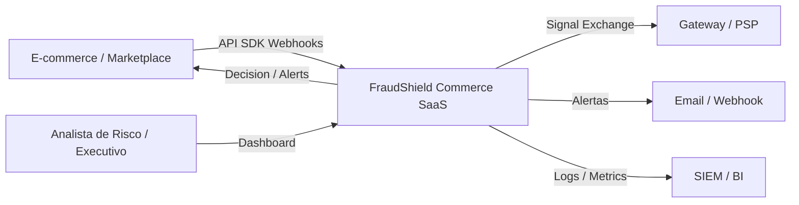
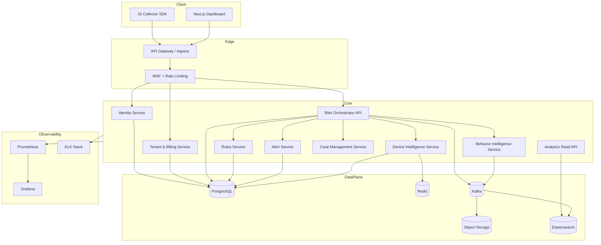

# FraudShield Commerce

## 1. Visao Executiva

FraudShield Commerce e uma plataforma SaaS B2B multi-tenant de anti-fraude para e-commerce com analise em tempo real, decisao orientada por risco, observabilidade completa e suporte a operacao enterprise. O produto foi desenhado para processar mais de 100.000 eventos por minuto no MVP expandido e evoluir com seguranca para mais de 1 milhao de usuarios e multiplos tenants.

Objetivos centrais:

- reduzir chargebacks, fraude de pagamento, fraude de cadastro, ATO, abuso promocional e bot traffic
- oferecer API-first onboarding para lojas, marketplaces e plataformas de comercio
- permitir acao automatica e revisao manual com trilha completa de auditoria
- operar com isolamento forte entre tenants e principios Zero Trust

## 2. Principios Arquiteturais

- Clean Architecture para isolar dominio, aplicacao, adapters e infraestrutura
- DDD para separar contextos: Identity, Tenant, Device Intelligence, Behavior Intelligence, Fraud Decisioning, Orders, Alerts, Billing
- Event-Driven Architecture para desacoplar ingestao, enrichment, scoring, alertas e analytics
- Zero Trust: autenticacao forte, autorizacao contextual, menor privilegio e verificacao continua
- Multi-tenancy com isolamento por `tenant_id` em dados, cache, topicos e autorizacao
- API-first com OpenAPI, versionamento e contratos idempotentes
- Escalabilidade horizontal stateless em frontend, API e workers

## 3. C4 - Contexto

## 4. C4 - Containers

## 5. Bounded Contexts

### 5.1 Tenant Management

- cadastro de empresas
- planos, quotas e limites
- membros, RBAC e configuracoes de integracao

### 5.2 Identity & Access

- usuarios internos do tenant
- OAuth2, JWT, MFA, SSO futuro
- sessoes, auditoria e autorizacao

### 5.3 Device Intelligence

- fingerprint web
- historico do dispositivo
- reputacao e vinculos com contas, pedidos e ips

### 5.4 Behavior Intelligence

- eventos de navegacao
- feature extraction
- score de automacao e comportamento anomalo

### 5.5 Fraud Decisioning

- motor de score 0-100
- regras, pesos, reason codes
- decisao: approve, review, block

### 5.6 Order & Identity Risk

- analise de cadastro, login, ATO e pedido
- correlacao entre cliente, conta, dispositivo e sessao

### 5.7 Alerts & Case Management

- alertas automatizados
- revisao manual
- comentarios, status e evidence trail

### 5.8 Billing & Metering

- consumo de API
- eventos processados
- usuarios ativos

## 6. Fluxos Principais

### 6.1 Analise de Evento

1. loja envia `POST /events` com idempotency key e contexto do tenant
2. API Gateway valida autenticacao, assinatura e rate limit
3. Risk Orchestrator normaliza evento e publica `risk.event.received`
4. Device/Behavior enrichment consomem o evento e anexam sinais
5. Rules/Scoring Engine calcula score, reason codes e decisao
6. resultado e persistido em PostgreSQL e indexado para busca
7. alertas/webhooks sao emitidos para o tenant quando aplicavel

### 6.2 Analise de Pedido

1. merchant envia `POST /orders/analyze`
2. plataforma consulta historico do cliente, device, velocity e reputacao
3. regras do tenant + regras globais sao executadas
4. resposta sincrona retorna `approve`, `review` ou `block`
5. evento assinado vai para Kafka para analytics e aprendizado

### 6.3 Login / Cadastro / ATO

- fluxo sincrono para decisao imediata
- fluxos assincronos para correlacao, alertas e enriquecimento futuro

## 7. Decisoes Arquiteturais

### 7.1 Monolito Modular primeiro, microservices depois

Escolha: iniciar com um monolito modular Spring Boot dividido por modulos de dominio, mantendo contratos internos claros e Kafka como espinha dorsal de eventos.

Justificativa:

- reduz custo e complexidade operacional no MVP
- preserva caminho de migracao para microservices
- facilita consistencia de dominio e produtividade da equipe inicial

### 7.2 PostgreSQL como system of record

Escolha: PostgreSQL para entidades transacionais e trilha de auditoria.

Justificativa:

- suporte maduro a particionamento, JSONB, RLS e indices avancados
- forte consistencia para tenant, usuarios, regras e decisoes

### 7.3 Redis para hot paths

Uso:

- counters de rate limit e velocity
- cache de fingerprints e sessoes
- locks curtos e deduplicacao

### 7.4 Kafka para pipelines de risco

Uso:

- ingestao de eventos
- fan-out para enrichment, alertas, analytics e billing
- tolerancia a pico de trafego e reprocessamento

### 7.5 Elastic para busca e timeline

Uso:

- busca por eventos, pedidos, clientes e dispositivos
- filtros rapidos e timeline operacional

### 7.6 API Gateway + WAF + rate limiting

Uso:

- defesa de perimetro
- roteamento por versao
- protecao contra abuso e burst traffic

## 8. Seguranca

- OWASP ASVS alinhado desde o design
- TLS 1.3 end-to-end
- segredos em Secret Manager / K8s Secrets com rotacao
- JWT curto + refresh token rotativo
- MFA obrigatorio para painel
- CSP restritiva no dashboard
- CSRF em sessoes browser sensiveis
- auditoria imutavel com hash chain para eventos criticos
- RLS ou filtros obrigatorios por `tenant_id`
- segregacao entre dados de producao, analytics e treinamento
- mascaramento de PII e criptografia em repouso

## 9. Multi-Tenancy

Modelo escolhido: shared application + shared database com isolamento logico forte por `tenant_id`, com possibilidade de tenancy dedicada para Enterprise.

Camadas de isolamento:

- autenticacao com escopo do tenant
- autorizacao por papel e recurso
- row filtering em queries e repositorios
- chaves de cache namespaced por tenant
- topicos e schemas de eventos com identificacao do tenant
- quotas por tenant

Estratégia Enterprise:

- tenants premium podem migrar para namespace dedicado em Kubernetes
- opcao futura de banco dedicado por tenant

## 10. Escalabilidade

Meta inicial:

- 100.000 eventos/minuto
- latencia p95 < 300 ms para analises sincronas
- disponibilidade alvo 99.9% MVP / 99.95% Enterprise

Estratégias:

- APIs stateless e autoscaling horizontal
- particionamento Kafka por tenant/event_type
- particionamento de tabelas de eventos por data e tenant
- indices compostos por tenant + timestamp + entidade
- jobs assincronos para enrichment pesado

## 11. Observabilidade

- logs estruturados JSON com trace_id, span_id, tenant_id, entity_id
- metricas RED e USE
- tracing distribuido com OpenTelemetry como extensao recomendada
- dashboards para throughput, erro, fila, score e acuracia operacional
- alertas SRE para latencia, lag de Kafka, saturacao de Redis e storage

## 12. Roadmap Tecnico

### Fase 1 - Foundation

- monorepo
- auth, tenant, rules, risk decision core
- dashboard executivo
- docker, k8s, terraform, CI/CD

### Fase 2 - Intelligence

- behavioral analytics avancado
- detector de bot mais sofisticado
- device graph
- case management completo

### Fase 3 - Enterprise

- SSO/SAML
- tenants dedicados
- explainability avancada
- machine learning supervisionado
