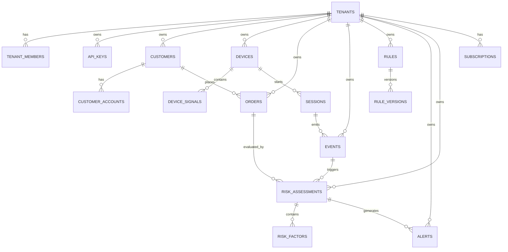

# FraudShield Commerce - Modelo de Dados

## 1. Entidades Principais

### Core SaaS

- tenants
- subscriptions
- plans
- tenant_members
- api_keys
- audit_logs

### Risco

- customers
- customer_accounts
- devices
- device_signals
- sessions
- events
- orders
- risk_assessments
- risk_factors
- alerts
- rules
- rule_versions
- cases

### Billing

- usage_meters
- invoices

## 2. Relacionamentos

## 3. Estrategia Multi-Tenant

- todas as tabelas transacionais possuem `tenant_id`
- chaves unicas compostas por `tenant_id` quando relevante
- indices sempre iniciam por `tenant_id` em tabelas operacionais
- eventos e tabelas volumetricas serao particionados por data

## 4. Tabelas Principais

### tenants

- id UUID PK
- name
- slug
- status
- tier
- created_at
- updated_at

### subscriptions

- id UUID PK
- tenant_id FK
- plan_code
- status
- event_quota_month
- active_users_quota
- started_at
- ends_at

### api_keys

- id UUID PK
- tenant_id FK
- key_prefix
- secret_hash
- scopes JSONB
- status
- last_used_at

### customers

- id UUID PK
- tenant_id FK
- external_customer_id
- email_hash
- cpf_hash
- phone_hash
- risk_level
- created_at

### devices

- id UUID PK
- tenant_id FK
- device_id unique tenant scoped
- fingerprint_hash
- trust_level
- first_seen_at
- last_seen_at
- is_blocked

### sessions

- id UUID PK
- tenant_id FK
- customer_id FK nullable
- device_id FK
- ip
- country_code
- user_agent
- started_at
- ended_at

### events

- id UUID PK
- tenant_id FK
- session_id FK nullable
- customer_id FK nullable
- device_id FK nullable
- event_type
- occurred_at
- source
- payload JSONB
- trace_id

### orders

- id UUID PK
- tenant_id FK
- external_order_id
- customer_id FK
- device_id FK nullable
- amount_cents
- currency
- status
- payment_method
- shipping_hash
- billing_hash
- created_at

### risk_assessments

- id UUID PK
- tenant_id FK
- entity_type
- entity_id
- assessment_type
- score
- decision
- reason_codes JSONB
- model_version
- created_at

### risk_factors

- id UUID PK
- assessment_id FK
- factor_code
- weight
- evidence JSONB

### alerts

- id UUID PK
- tenant_id FK
- assessment_id FK
- severity
- title
- status
- channel
- created_at

### rules

- id UUID PK
- tenant_id FK
- name
- category
- priority
- status
- expression
- action
- created_at

### rule_versions

- id UUID PK
- rule_id FK
- version_number
- expression
- published_by
- published_at

### audit_logs

- id UUID PK
- tenant_id FK nullable
- actor_type
- actor_id
- action
- entity_type
- entity_id
- previous_hash
- entry_hash
- metadata JSONB
- created_at

## 5. Indices Criticos

- `events (tenant_id, occurred_at desc)`
- `events (tenant_id, event_type, occurred_at desc)`
- `orders (tenant_id, external_order_id)`
- `risk_assessments (tenant_id, entity_type, entity_id, created_at desc)`
- `devices (tenant_id, device_id)`
- `customers (tenant_id, external_customer_id)`

## 6. Retencao

- eventos crus: 90 dias padrao, 365 dias enterprise
- agregados de analytics: 24 meses
- auditoria: 7 anos ou por contrato
